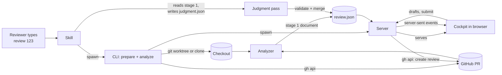
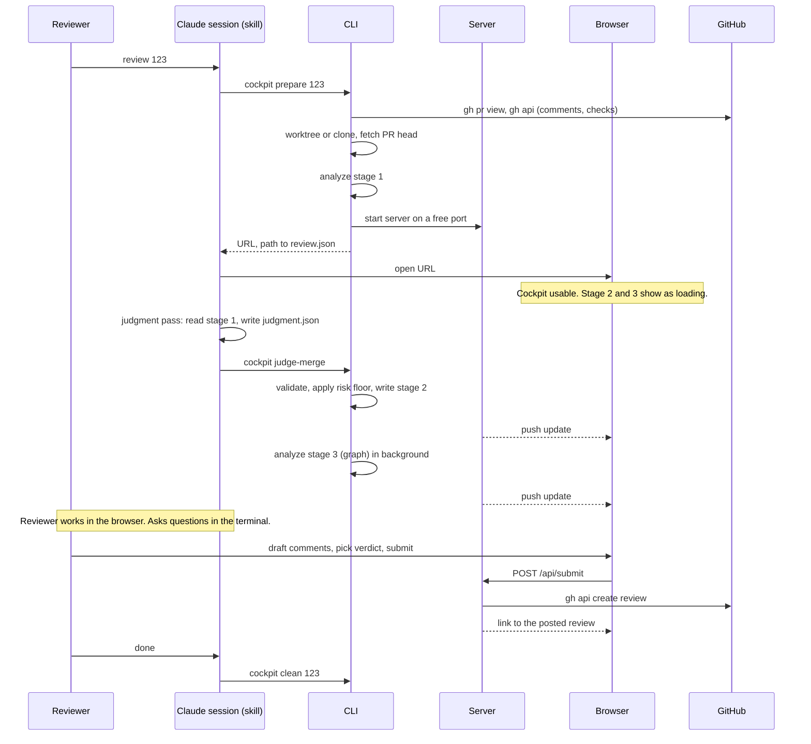

# 02 — Architecture

Status: draft for review. Builds on `01-product-brief.md`.

## One paragraph

A Claude Code skill named `review` turns a PR number into a running local web app. A command line tool does the heavy lifting: it checks out the PR, runs a deterministic analyzer over the local repository, and starts a local server. The server serves a prebuilt web UI, the cockpit, and holds one JSON file: the review document. The resident Claude session adds its judgment to that document in a second pass, and the cockpit updates live. When the reviewer submits, the server posts one GitHub review through `gh api`. The review document is the only contract between the pieces. Everything on either side of it can be replaced.

## Components

| Component | What it is | Runs where | Owns |
|---|---|---|---|
| **Skill** | `SKILL.md` plus a thin wrapper. Teaches Claude Code what `review <pr>` means and how to do the judgment pass. | Inside the Claude Code session | The conversation with the reviewer |
| **CLI** (`cockpit`) | A Node program with subcommands: `prepare`, `analyze`, `compact`, `judge-prompt`, `judge-merge`, `serve`, `clean`, `validate`, `merge`, and later `submit`. | Spawned by the skill | Orchestration, checkout, process lifecycle |
| **Analyzer** | A library the CLI calls. Reads the local checkout and produces the deterministic part of the review document. | Inside the CLI process | Diff parsing, git signals, tree-sitter signals, generated-code detection |
| **Schema package** | JSON Schema for the review document plus a validator and TypeScript types. | Imported by every other component | The contract |
| **Server** | A small HTTP server. Serves the cockpit's static files, the review document, and a local API for drafts and submit. | Background process, one per review | Live state, write-back |
| **Cockpit** | A React app built once into static files. Renders the review document and nothing else. | The reviewer's browser | Presentation and interaction |
| **Judgment pass** | The LLM step. Reads the deterministic document, returns groupings, order, reasons and risk adjustments in a strict JSON shape. | The resident Claude session | Semantic judgment |

All components live in one repository as npm workspaces: `packages/schema`, `packages/analyzer`, `packages/server`, `packages/cockpit`, `packages/cli`, and `skill/`.

## Data flow



Two ideas carry the design:

1. **The review document is the only shared state.** The analyzer writes it. The judgment pass amends it. The server serves it. The cockpit reads it. No component talks to another component's internals.
2. **The document arrives in stages.** Each top-level section carries a status: `pending`, `ready`, or `failed`. The cockpit renders whatever is ready and labels the rest. The server watches the file and pushes each change to the browser over server-sent events.

## The review document, briefly

The full schema is in `03-review-document-schema.md`. The shape that matters for this doc:

```
{
  version, pr, checkout,
  files[]      stage 1   the diff, per file, per hunk, with deterministic risk
  signals      stage 1   raw numbers per file: churn, bugfix density, complexity, fan-in, fan-out
  comments[]   stage 1   existing PR review comments from bots and people, pinned to file and line
  checks[]     stage 1   CI check results for the status strip
  groups[]     stage 2   semantic groups such as "mechanical rename of Foo to Bar"
  path[]       stage 2   recommended walk order over hunks
  reasons      stage 2   plain-language "why risky" per high-risk hunk
  graph        stage 3   nodes and edges for the blast-radius map
  status       per section: pending | ready | failed, with a message
}
```

Stage 1 is deterministic and fast. Stage 2 needs the LLM. Stage 3 is the tree-sitter call graph, which is deterministic but slow on a large repository, so it gets its own stage.

## Session lifecycle



### Step by step

**1. Resolve the PR.** Accept `123`, `owner/repo#123`, or a full URL. With a bare number, the current directory must be inside a git clone with a GitHub remote. `gh pr view` fetches the head SHA, base SHA, title, body and labels, and the committer emails on the pull request's own commits, which are the author identities the history signals need.

The diff and the history pass use the merge base of the base SHA and the head SHA rather
than the base SHA itself, which is what `base...head` means to git. `pr.base.sha` in the
document is still the SHA GitHub reported. On a merged pull request the two differ by
everything that landed after it.

**2. Checkout.** If a local clone of the repository is found, add a git worktree at the PR head under the cache directory. If not, clone into the cache directory with full history. The head SHA is recorded in the document; every comment posted later is bound to it.

Where to look for local clones: the current directory's repository first. Then a list of workspace roots from the optional global config. Then give up and clone.

**3. Stage 1 analysis.** Parse the diff between base and head. For each changed file, compute git signals from history and structure signals from tree-sitter. Detect generated files by built-in patterns. Fetch existing review comments and check runs. Compute the deterministic risk per hunk. Write the document with stage 2 and 3 marked pending.

At M3 `comments` and `checks` are written as empty arrays with status `ready`: ingestion is
M5, and a section marked `pending` would make the cockpit render a placeholder for something
nothing is going to deliver yet.

`pr.additions`, `pr.deletions` and `pr.changedFiles` are recomputed from the parsed diff
rather than taken from `gh`. GitHub counts a rename and a binary file differently, and the
validator requires the totals to match the hunks in the document, which are the only lines
the reviewer can actually see.

**4. Serve and open.** Start the server on a free port. Print the URL. The skill opens the browser. The cockpit is usable from this moment, with the recommended order and the graph tab showing a loading state.

The server reserves `POST /api/drafts`, `POST /api/submit` and `POST /api/ask` and answers
501 on them until M6, so the route names cannot drift. It watches the directory holding
`review.json`, not the file: the analyzer publishes by writing a temp file and renaming it,
and a watch bound to the old inode goes quiet after the first write.

`cockpit analyze --expect-judgment` says that step 5 will follow. Without the flag the stage
2 sections are written `pending` with the message `not-attached`, and the cockpit says "Not
analyzed" rather than "Analyzing…", so a placeholder never claims work that no process is
doing. The `review` skill always passes it, because it always runs the judgment pass.

**5. Judgment pass.** `cockpit analyze` writes `compact.md` next to the document, and
`cockpit compact` rewrites it on its own: a legend, the pull request and its body, the file
list with the rule that folded each generated file, the stage 1 groups, and one block per
hunk that is not generated, carrying its id, path, enclosing symbols, kind, risk floor with
the signals behind it, and the change text — in full under 40 changed lines, the first 15
otherwise.

`cockpit judge-prompt <pr>` prints the whole prompt to stdout: the instructions, the judgment
JSON Schema embedded from `packages/schema/schemas`, the floor rules, the merge rules, the
shape of the summary, and the compact view at the end. The prompt text lives in
`skill/review/judgment-prompt.md` with `{{placeholders}}` the CLI fills (ADR-32), so it is
reviewable as text rather than buried in a string. It names one output path and one next
command.

`cockpit judge-merge <pr>` reads `judgment.json`, validates it, merges it, validates the
merged document and writes it by rename, so a cockpit that is already open picks it up over
server-sent events. Every dropped or clamped proposal is printed and appended to `log.txt`.

The compact view is not always smaller than the diff. On a 24-file, 194-hunk pull request it
came to 164 kB against 131 kB of `gh pr diff` and 776 kB of `review.json`: the change text
inside it is 88 kB, two thirds of the raw diff, and the rest is the per-hunk metadata the
judgment pass needs. It replaces the document as the model's input, not the diff as the
reviewer's.

**6. Graph stage.** The CLI builds the call graph for the changed Go functions: what they call and what calls them, one hop out, within the repository. Written as stage 3.

At M3 the graph runs inside `cockpit analyze`, after stage 1 has been written, and rewrites
the document when it is done. It is a second write rather than a background process: the
server pushes the change to a cockpit that is already open, which is the behaviour the stage
was for, and one process is one thing to fail. A pull request that changes no Go file gets an
empty graph with status `ready`, not `failed`; there is nothing to draw and nothing went
wrong. `--skip-graph` leaves stage 3 `pending`.

Every Go file in the checkout is parsed once and cached under `index/<commit>.json`, keyed by
file path and blob SHA, so the next pull request of the same repository reparses only the
files whose content changed. Measured on a repository with 839 Go files in the checkout: 3.3
seconds cold, 0.13 warm, and 794 of 852 files reused across two different pull requests.

**7. Review.** The reviewer works in the browser. Drafts are saved to the server on every keystroke and stored beside the document, so a server restart loses nothing. Questions about the code go to Claude in the terminal, which still has the checkout and the document in context.

**8. Submit.** The cockpit shows a dry-run preview: every draft comment with its file, line and side, and the verdict. On confirm, the server first checks that the PR head on GitHub still matches the recorded SHA. If it moved, it stops and tells the reviewer to re-run the review. Otherwise it posts one review through `gh api` with all comments attached.

**9. Clean up.** `cockpit clean` stops the server, removes the worktree or temp clone, and keeps the review document and drafts in the cache for later inspection.

## The judgment pass: who calls the LLM

Three options were considered.

| Option | How | Trade-off |
|---|---|---|
| **A. Resident session does it** | The skill tells the current Claude session to read stage 1 and write `judgment.json`. | No API key, no extra cost model, one session. The reviewer waits in the terminal for a minute while the cockpit is already open. Recommended. |
| B. CLI calls the Anthropic API | The analyzer sends a prompt and parses the response. | Fully automatic and works headless. Needs an API key and separate billing. Adds a second Claude identity to manage. |
| C. CLI spawns `claude -p` | A headless Claude Code subprocess does the judgment. | Automatic, same login as the user. Slower to start and harder to debug. Good fallback for a non-interactive mode later. |

Decision: A for v1. The document format makes B or C a drop-in swap later.

## Cockpit-to-agent questions

Out of scope for v1, but the mechanism should be chosen now so the server does not block it.

Claude Code cannot be pushed to by a web server. It can, however, be woken by a background process that exits. The server can therefore expose `POST /api/ask`, append the question to a queue file, and the skill can run a small `cockpit wait-question` process in the background that exits as soon as a question arrives. Claude wakes, answers, and writes the reply to the queue file, which the server pushes to the browser. This costs nothing in v1 beyond keeping the API route reserved.

## Write-back details

GitHub's review API takes one call with a list of comments. Each comment needs `path`, `line`, `side` (`LEFT` or `RIGHT`) and `body`, and the review needs `commit_id` and an `event` of `COMMENT`, `REQUEST_CHANGES` or `APPROVE`. The cockpit stores drafts in exactly these terms from the moment they are typed, using the line numbers from the parsed diff. No translation happens at submit time, so there is no step where a line can drift.

Multi-line comments use `start_line` and `start_side` as well. Comments on lines outside the diff are not allowed by GitHub, and the cockpit refuses to create them.

The server posts as the user's own `gh` identity. The tool never holds a token of its own.

## Storage layout

```
~/.cache/review-cockpit/
  <owner>/<repo>/
    repo/                  temp clone, only when no local clone was found
    index/                 tree-sitter symbol index, one file per commit, keyed inside by
                           path and blob sha; reused across PRs of this repository, three
                           most recent kept
    pr-123/
      worktree/            git worktree at the PR head
      review.json          the document, all stages
      compact.md           the pull request as text for the judgment pass
      judgment.json        raw LLM output, kept for debugging
      judgment.rejected.json   the last judgment that failed validation
      drafts.json          the reviewer's unsent comments and verdict
      server.json          port and pid of the running server
      log.txt
```

An optional `~/.config/review-cockpit/config.json` holds workspace roots to search for local clones, and nothing else in v1. Per-repository overrides for generated-code patterns and sensitive paths live in `.review-cockpit.json` at the repository root, and are optional.

## Failure behavior

- **`gh` not authenticated:** stop before checkout with the exact `gh auth login` command to run.
- **Repository too large to clone in the budget:** the CLI reports progress and keeps going. The startup budget is a target, not a timeout.
- **Judgment pass returns invalid JSON:** `judge-merge` writes nothing, keeps the file as
  `judgment.rejected.json`, prints the first five errors in plain words and one line saying
  where to write the corrected file, and exits non-zero. The session fixes it and retries
  once. After a second rejection the skill stops and says so; the stage 2 sections stay
  `pending` and the cockpit works from deterministic risk alone. Marking them `failed` is
  M7's job, since M4 has no process that owns the second failure.
- **Graph stage fails or times out:** stage 3 is marked failed. The graph tab shows the message. Nothing else is affected.
- **Nothing is written into the user's clone** but the objects a fetch brings in, one ref
  under `refs/review-cockpit/`, and the worktree registration. `cockpit clean` removes both.
  The analyzer does not run `git worktree prune`, which would drop registrations belonging to
  other tools, except when its own worktree path is registered with no directory behind it
  and prune is the only way to re-add it.
- **PR head moved before submit:** submit is refused with a clear message. Drafts are kept. `review 123` again re-analyzes and re-attaches drafts whose file and line still exist, and lists the ones it could not place.
- **Server dies:** `review 123` again finds the cached document and drafts and restarts the server without re-analyzing, unless the head SHA changed.

## What is deliberately not here

- No database. One JSON document and one drafts file per PR.
- No authentication on the local server. It binds to `127.0.0.1` only.
- No build step at review time. The cockpit is compiled once when the tool is installed.
- No agent-side state outside the cache directory. Removing the directory resets everything.
