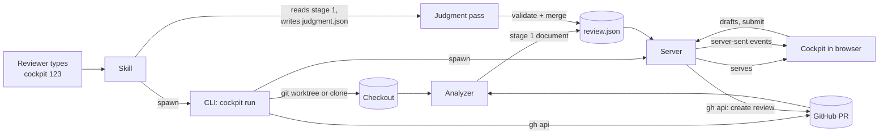
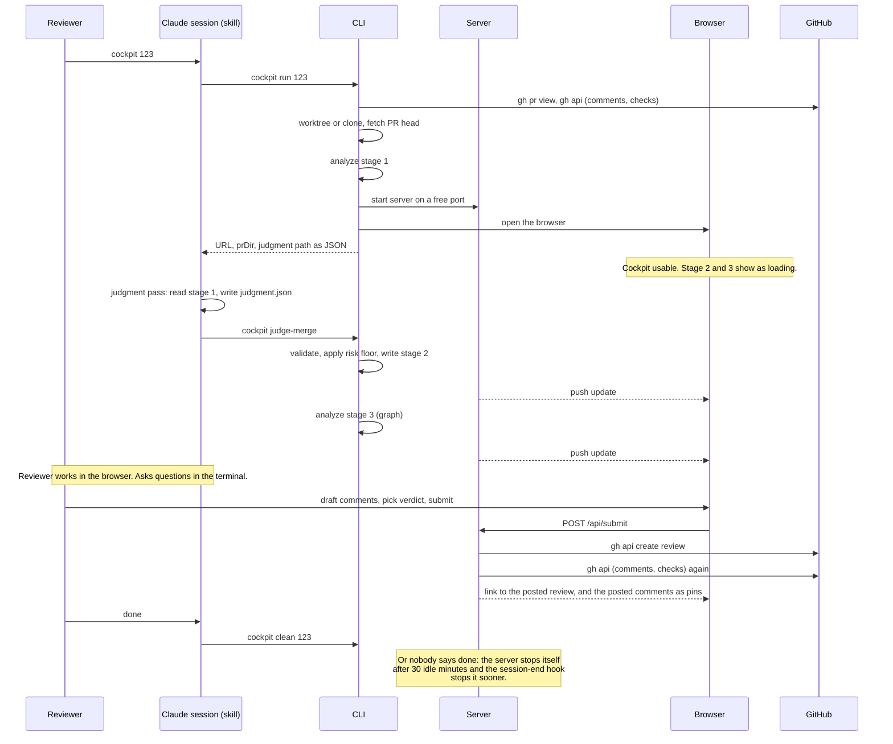

# 02 — Architecture

Status: draft for review. Builds on `01-product-brief.md`.

## One paragraph

A Claude Code skill named `cockpit` turns a PR number into a running local web app. A command line tool does the heavy lifting: `cockpit run` checks out the PR, runs a deterministic analyzer over the local repository, and starts a local server. The server serves a prebuilt web UI, the cockpit, and holds one JSON file: the review document. The resident Claude session adds its judgment to that document in a second pass, and the cockpit updates live. When the reviewer submits, the server posts one GitHub review through `gh api`. The review document is the only contract between the pieces. Everything on either side of it can be replaced.

## Components

| Component | What it is | Runs where | Owns |
|---|---|---|---|
| **Skill** | `skills/cockpit/SKILL.md` and the judgment prompt beside it. Teaches Claude Code what `cockpit <pr>` means and how to do the judgment pass. | Inside the Claude Code session | The conversation with the reviewer |
| **CLI** (`cockpit`) | A Node program with subcommands: `run`, `prepare`, `analyze`, `compact`, `judge-prompt`, `judge-merge`, `mark-failed`, `serve`, `stop`, `clean`, `gc`, `ps`, `doctor`, `validate`, `merge`. | Spawned by the skill | Orchestration, checkout, process lifecycle |
| **Analyzer** | A library the CLI calls. Reads the local checkout and produces the deterministic part of the review document. | Inside the CLI process | Diff parsing, git signals, tree-sitter signals, generated-code detection |
| **Schema package** | JSON Schema for the review document plus a validator and TypeScript types. | Imported by every other component | The contract |
| **Server** | A small HTTP server. Serves the cockpit's static files, the review document, and a local API for drafts and submit. | Background process, one per review | Live state, write-back |
| **Cockpit** | A React app built once into static files. Renders the review document and nothing else. | The reviewer's browser | Presentation and interaction |
| **Plugin** | `.claude-plugin/` with the marketplace and plugin manifests, `bin/cockpit`, and `hooks/hooks.json`. Packages the skill and the CLI so one `/plugin install` is the whole install. | Claude Code, at session start and session end | Distribution, the first build, and stopping this session's servers |
| **Judgment pass** | The LLM step. Reads the deterministic document, returns groupings, order, reasons and risk adjustments in a strict JSON shape. | The resident Claude session | Semantic judgment |

All components live in one repository as npm workspaces: `packages/schema`, `packages/analyzer`, `packages/server`, `packages/cockpit`, `packages/cli`, and `skills/`.

## Data flow



Two ideas carry the design:

1. **The review document is the only shared state.** The analyzer writes it. The judgment pass amends it. The server serves it. The cockpit reads it. No component talks to another component's internals.
2. **The document arrives in stages.** Each top-level section carries a status: `pending`, `ready`, or `failed`. The cockpit renders whatever is ready and labels the rest. The server watches the file and pushes each change to the browser over server-sent events.

## The review document, briefly

The full schema is in `03-review-document-schema.md`. The shape that matters for this doc:

```
{
  version, pr, checkout,
  files[]      stage 1   the diff, per file, per hunk, with deterministic risk
  signals      stage 1   raw numbers per file: churn, bugfix density, complexity, fan-in, fan-out
  comments[]   stage 1   existing PR review comments from bots and people, pinned to file and line
  conversation stage 1   comments with no line to pin them to
  checks[]     stage 1   CI check results for the status strip
  botSummaries stage 1   a review summary a bot wrote into the PR body, lifted out of it
  groups[]     stage 2   semantic groups such as "mechanical rename of Foo to Bar"
  path[]       stage 2   recommended walk order over hunks
  reasons      stage 2   plain-language "why risky" per high-risk hunk
  graph        stage 3   nodes and edges for the blast-radius map
  status       per section: pending | ready | failed, with a message
}
```

Stage 1 is deterministic and fast. Stage 2 needs the LLM. Stage 3 is the tree-sitter call graph, which is deterministic but slow on a large repository, so it gets its own stage.

## Session lifecycle



One command does steps 1 to 6. `cockpit run <pr>` resolves the pull request, checks it out,
writes stage 1, starts the server, opens the browser and then builds the graph, printing one
line per stage to stderr and one line of JSON to stdout: `{url, prDir, compact, judgmentOut,
headSha}`. The order is what matters: the browser opens on stage 1, not after the graph
(ADR-46). The steps stay separate commands underneath, so a step can be run or debugged on
its own.

### Step by step

**1. Resolve the PR.** Accept `123`, `owner/repo#123`, or a full URL. With a bare number, the current directory must be inside a git clone with a GitHub remote. `gh pr view` fetches the head SHA, base SHA, title, body and labels, and the committer emails on the pull request's own commits, which are the author identities the history signals need.

The diff and the history pass use the merge base of the base SHA and the head SHA rather
than the base SHA itself, which is what `base...head` means to git. `pr.base.sha` in the
document is still the SHA GitHub reported. On a merged pull request the two differ by
everything that landed after it.

**2. Checkout.** If a local clone of the repository is found, add a git worktree at the PR head under the cache directory. If not, clone into the cache directory with full history. The head SHA is recorded in the document; every comment posted later is bound to it.

Where to look for local clones: the current directory's repository first. Then a list of workspace roots from the optional global config. Then give up and clone.

**3. Stage 1 analysis.** Parse the diff between base and head. For each changed file, compute git signals from history and structure signals from tree-sitter. Detect generated files by built-in patterns. Fetch what the pull request already knows. Compute the deterministic risk per hunk. Write the document with stage 2 and 3 marked pending.

What the fetch is, five `gh` calls: review comments
(`pulls/{n}/comments --paginate`) mapped to file, line, side and hunk id; top-level comments
(`issues/{n}/comments --paginate`), which have no line and go to `conversation`; one GraphQL
query for `pullRequest.reviewThreads`, which is the only API that says whether a thread is
resolved or outdated; check runs (`commits/{headSha}/check-runs --paginate`) and the legacy
commit statuses (`commits/{headSha}/status`), normalised to one status vocabulary and
deduplicated by name. The Cursor Bugbot summary is parsed out of the pull request body, which
`gh pr view` already returned in step 1, and costs no call.

Comments and checks fail independently: a fetch that fails leaves its section `failed` with
the `gh` error as its message, and the rest of stage 1 is written as usual. Nothing about the
diff depends on GitHub answering.

Re-analysing the same head keeps the judgment pass's work. Stage 2 is read back out of the
cached document as a judgment file and re-merged onto the fresh stage 1, so the clamp, group
and coverage rules decide what still fits; a stage 2 that no longer validates against the new
diff is dropped with a reason printed. The head moving is what makes the judgment stale, so
that is the one condition the carry checks first (ADR-41).

`pr.additions`, `pr.deletions` and `pr.changedFiles` are recomputed from the parsed diff
rather than taken from `gh`. GitHub counts a rename and a binary file differently, and the
validator requires the totals to match the hunks in the document, which are the only lines
the reviewer can actually see.

**4. Serve and open.** Start the server on a free port. Print the URL. Open the browser. The cockpit is usable from this moment, with the recommended order and the graph tab showing a loading state.

`cockpit run` starts the server as a detached `cockpit serve` and waits for its
`/api/health` to answer, because the resident session needs its terminal back while the
server keeps running. A pull request whose server is already alive is served by that server;
`--reuse-server` also leaves the browser tab it is serving alone.

The server stops itself after 30 minutes with no cockpit connected (ADR-50). An open cockpit
holds an event stream, so the count of attached streams is what "somebody is here" means, and
any request starts the window again. `--idle-minutes` changes the window and 0 turns it off.

The API is seven routes. `GET /` is the built cockpit, `GET /api/document` the document,
`GET /api/events` its change stream, `GET` and `PUT /api/drafts` the drafts file,
`POST /api/submit` posts the review, `POST /api/refresh` re-reads the comments and the checks
from GitHub, and `GET /api/health` says the server is up, with the token from its `server.json`,
the number of attached cockpits and how long it has had none. `POST /api/ask` stays reserved and
answers 501, so the route name cannot drift. The server watches the directory holding `review.json`, not the
file: the analyzer publishes by writing a temp file and renaming it, and a watch bound to the
old inode goes quiet after the first write.

`cockpit analyze --expect-judgment` says that step 5 will follow. Without the flag the stage
2 sections are written `pending` with the message `not-attached`, and the cockpit says "Not
analyzed" rather than "Analyzing…", so a placeholder never claims work that no process is
doing. `cockpit run` always passes it, because the skill always runs the judgment pass.

**5. Judgment pass.** `cockpit analyze` writes `compact.md` next to the document, and
`cockpit compact` rewrites it on its own: a legend, the pull request and its body, the file
list with the rule that folded each generated file, the stage 1 groups, and one block per
hunk that is not generated, carrying its id, path, enclosing symbols, kind, risk floor with
the signals behind it, and the change text — in full under 40 changed lines, the first 15
otherwise.

`cockpit judge-prompt <pr>` prints the whole prompt to stdout: the instructions, the judgment
JSON Schema embedded from `packages/schema/schemas`, the floor rules, the merge rules, the
shape of the summary, and the compact view at the end. The prompt text lives in
`skills/cockpit/judgment-prompt.md` with `{{placeholders}}` the CLI fills (ADR-32), so it is
reviewable as text rather than buried in a string. It names one output path and one next
command.

`cockpit judge-merge <pr>` reads `judgment.json`, validates it, merges it, validates the
merged document and writes it by rename, so a cockpit that is already open picks it up over
server-sent events. Every dropped or clamped proposal is printed and appended to `log.txt`.

The compact view is not always smaller than the diff. On a 24-file, 194-hunk pull request it
came to 164 kB against 131 kB of `gh pr diff` and 776 kB of `review.json`: the change text
inside it is 88 kB, two thirds of the raw diff, and the rest is the per-hunk metadata the
judgment pass needs. It replaces the document as the model's input, not the diff as the
reviewer's.

**6. Graph stage.** The CLI builds the call graph for the changed Go functions: what they call and what calls them, one hop out, within the repository. Written as stage 3.

At M3 the graph runs inside `cockpit analyze`, after stage 1 has been written, and rewrites
the document when it is done. It is a second write rather than a background process: the
server pushes the change to a cockpit that is already open, which is the behaviour the stage
was for, and one process is one thing to fail. A pull request that changes no Go file gets an
empty graph with status `ready`, not `failed`; there is nothing to draw and nothing went
wrong. `--skip-graph` leaves stage 3 `pending`.

Every Go file in the checkout is parsed once and cached under `index/<commit>.json`, keyed by
file path and blob SHA, so the next pull request of the same repository reparses only the
files whose content changed. Measured on a repository with 839 Go files in the checkout: 3.3
seconds cold, 0.13 warm, and 794 of 852 files reused across two different pull requests.

**7. Review.** The reviewer works in the browser. Every change to a draft, the verdict or the
review body is written to browser storage at once and sent to the server 300 ms later, so a
burst of typing is one `PUT /api/drafts` and a crash loses at most that. The server validates
the file with `validateDrafts`, writes it beside the document by rename, and answers with what
it stored, stamped with its own clock; the cockpit keeps that stamp, so on reload the two
copies are ordered by one clock and the newer one wins (ADR-42). A server that has never been
written to answers with an empty file carrying no `updatedAt`, which is how the cockpit reads
"the server holds nothing" and keeps its own copy. Questions about the code go to Claude in the
terminal, which still has the checkout and the document in context.

**8. Submit.** The cockpit shows a dry-run preview: every draft comment with its file, line and
side, and the verdict. `POST /api/submit` carries the verdict and the review body and nothing
else: the drafts come off disk, so what the dry-run list showed is what is posted (ADR-43).
The server runs `gh pr view <n> --repo <owner>/<repo> --json headRefOid` first and refuses with
409 `{code: "head_moved", expected, actual}` when it differs from `pr.head.sha`. Otherwise it
posts one review, `gh api repos/{owner}/{repo}/pulls/{n}/reviews -X POST --input -` with
`commit_id`, `body`, `event` and the comments as `path`, `line`, `side` and, for a range,
`start_line` and `start_side`. On success it answers `{url, id, comments, submitted}`, moves
`drafts.json` to `submitted-<timestamp>.json` and leaves an empty drafts file behind. On
failure the drafts are untouched and the answer says why: `{code: "own_pr"}` in one plain
sentence when GitHub refuses an approval or a change request on the reviewer's own pull
request, and `{code: "gh_failed", message, exitCode}` with the `gh` error otherwise. A comment
review with no drafts and an empty body is refused by the cockpit before it becomes a
request, because GitHub would post nothing at all.

A successful post ends with one more fetch. The server re-reads the review comments, the
conversation and the checks for the document's head and rewrites the document, so what the
reviewer just posted comes back as pinned threads a second later without a re-analysis
(ADR-47). It happens before the response, so the cockpit's own reload shows the pins. Nothing
else in the document is touched: the diff, the risk and the judgment belong to the analysis.
A fetch that fails leaves `status.comments` or `status.checks` `failed` with the `gh` message
and costs nothing else, and the posted review is unaffected either way.
`POST /api/refresh` runs the same fetch on demand, which is the "Refresh from GitHub" button
next to the check pills in the cockpit header.

**9. Clean up.** `cockpit clean` stops the server, removes the worktree or temp clone, and keeps
the review document and drafts in the cache for later inspection. It is what the skill runs when
the user says "done", and it is no longer the only thing that ends a review, because nobody ran
it (ADR-50).

Three things clean up on their own. The server stops itself after 30 idle minutes. A `SessionEnd`
hook runs `scripts/plugin-session-end.sh`, which runs `cockpit stop --started-by <session id>`
from the payload's `session_id`, or `cockpit stop --all` when the payload carries none;
`cockpit run` records that id in `server.json`, which is how the two ends match. And `cockpit gc`
removes the worktree and the `refs/review-cockpit/` ref of every cached pull request with no
server running and a document older than seven days, which `cockpit run` does a pass of at the
end of a successful start.

`cockpit stop` only ever signals a process it can show is a cockpit server: one that answers
`/api/health` with the token in its own `server.json`, or, when it answers nothing, one whose
command line is a `cockpit … serve`. A pid is not enough, because pids are reused and a
`server.json` left by a crash would otherwise name an unrelated process. `cockpit ps` lists what
is running, and `cockpit doctor` counts it.

**Installation.** There are two of them, running the same files. The distributed one is a
Claude Code plugin (ADR-49): `.claude-plugin/marketplace.json` makes this repository a
marketplace holding one plugin whose source is the repository root, so adding the repository as
a marketplace and installing `cockpit` from it is the whole install. `skills/cockpit` is the
skill, `bin/cockpit` is the `cockpit` command — Claude Code puts an enabled plugin's `bin/` on
the Bash tool's PATH — a `SessionStart` hook runs `scripts/plugin-bootstrap.sh`, which
builds the checkout the install brought once and then costs a few file tests on every later
start, and a `SessionEnd` hook runs `scripts/plugin-session-end.sh`, which stops the servers
this session started.

The other is for working on the cockpit itself. `scripts/install.sh` installs the dependencies,
builds every package, puts `cockpit` on PATH — `npm link`, or a symlink in `~/.local/bin` when
the global prefix is not writable — and symlinks `skills/cockpit` to
`~/.claude/skills/cockpit` (ADR-45). `scripts/uninstall.sh` reverses it and keeps the cache.
`cockpit doctor` reports the node version, `gh` and its login, the build, the plugin root when
a session set one, the skill — the plugin's own or the symlink — and the optional config with
its workspace roots as a table, and exits non-zero when something has to be fixed.

## The judgment pass: who calls the LLM

Three options were considered.

| Option | How | Trade-off |
|---|---|---|
| **A. Resident session does it** | The skill tells the current Claude session to read stage 1 and write `judgment.json`. | No API key, no extra cost model, one session. The reviewer waits in the terminal for a minute while the cockpit is already open. Recommended. |
| B. CLI calls the Anthropic API | The analyzer sends a prompt and parses the response. | Fully automatic and works headless. Needs an API key and separate billing. Adds a second Claude identity to manage. |
| C. CLI spawns `claude -p` | A headless Claude Code subprocess does the judgment. | Automatic, same login as the user. Slower to start and harder to debug. Good fallback for a non-interactive mode later. |

Decision: A for v1. The document format makes B or C a drop-in swap later.

## Cockpit-to-agent questions

Out of scope for v1, but the mechanism should be chosen now so the server does not block it.

Claude Code cannot be pushed to by a web server. It can, however, be woken by a background process that exits. The server can therefore expose `POST /api/ask`, append the question to a queue file, and the skill can run a small `cockpit wait-question` process in the background that exits as soon as a question arrives. Claude wakes, answers, and writes the reply to the queue file, which the server pushes to the browser. This costs nothing in v1 beyond keeping the API route reserved.

## Write-back details

GitHub's review API takes one call with a list of comments. Each comment needs `path`, `line`, `side` (`LEFT` or `RIGHT`) and `body`, and the review needs `commit_id` and an `event` of `COMMENT`, `REQUEST_CHANGES` or `APPROVE`. The cockpit stores drafts in exactly these terms from the moment they are typed, using the line numbers from the parsed diff. No translation happens at submit time, so there is no step where a line can drift.

Multi-line comments use `start_line` and `start_side` as well. Comments on lines outside the diff are not allowed by GitHub, and the cockpit refuses to create them.

The server posts as the user's own `gh` identity. The tool never holds a token of its own, and
the `gh` runner is injected, so the tests exercise every path without a network.

Measured against a scratch pull request: a single-line `RIGHT` comment, a `start_line`/`line`
range on `RIGHT`, and a comment on a deleted line on `LEFT` all came back from
`pulls/{n}/comments` on exactly the path, line and side they were sent with. GitHub's own
refusals are mapped rather than passed through raw: `Can not approve your own pull request` and
`Can not request changes on your own pull request` both become `{code: "own_pr"}` with one
plain sentence, because the reviewer needs to know to switch verdict, not to read an HTTP
status.

## Storage layout

```
~/.cache/review-cockpit/
  <owner>/<repo>/
    repo/                  temp clone, only when no local clone was found
    index/                 tree-sitter symbol index, one file per commit, keyed inside by
                           path and blob sha; reused across PRs of this repository, three
                           most recent kept
    pr-123/
      worktree/            git worktree at the PR head
      review.json          the document, all stages
      compact.md           the pull request as text for the judgment pass
      judgment.json        raw LLM output, kept for debugging
      judgment.rejected.json   the last judgment that failed validation
      drafts.json          the reviewer's unsent comments, verdict and review body
      drafts.orphaned.json     the drafts a re-analysis could not re-attach
      submitted-<ts>.json  one file per posted review, the drafts as they were sent
      server.json          the running server: port, pid, url, startedAt, token — which
                           /api/health answers with, so `cockpit stop` can prove a pid is
                           ours — and sessionId, the Claude Code session that asked for it
      log.txt
```

An optional `~/.config/review-cockpit/config.json` holds workspace roots to search for local clones, and nothing else in v1. Per-repository overrides for generated-code patterns and sensitive paths live in `.review-cockpit.json` at the repository root, and are optional.

## Failure behavior

- **`gh` not authenticated:** stop before checkout with the exact `gh auth login` command to run.
- **Repository too large to clone in the budget:** the CLI reports progress and keeps going. The startup budget is a target, not a timeout.
- **Judgment pass returns invalid JSON:** `judge-merge` writes nothing, keeps the file as
  `judgment.rejected.json`, prints the first five errors in plain words and one line saying
  where to write the corrected file, and exits non-zero. The session fixes it and retries
  once. After a second rejection the skill runs `cockpit mark-failed <pr> --stage 2 --message
  "<one line>"`, which sets `groups`, `path` and `summary` to `failed` with that message, so
  the cockpit says the judgment failed instead of promising work nobody is doing. The rest of
  the cockpit works from deterministic risk alone.
- **Graph stage fails or times out:** stage 3 is marked failed. The graph tab shows the message. Nothing else is affected.
- **Nothing is written into the user's clone** but the objects a fetch brings in, one ref
  under `refs/review-cockpit/`, and the worktree registration. `cockpit clean` removes both.
  The analyzer does not run `git worktree prune`, which would drop registrations belonging to
  other tools, except when its own worktree path is registered with no directory behind it
  and prune is the only way to re-add it.
- **`gh` cannot answer for comments or checks:** the section is marked `failed` with the `gh`
  error, the header says "Checks unavailable" rather than "No checks reported", and every
  other part of stage 1 is written.
- **PR head moved before submit:** submit is refused with 409 and a message naming both
  shas. Nothing is posted and the drafts are kept. `cockpit analyze` again re-attaches every
  draft whose line the new commits left in the diff, updates its `commitId`, and moves the
  rest to `drafts.orphaned.json`; the counts go to stderr and the cockpit shows an amber
  banner over the list (ADR-44).
- **Server dies:** `cockpit serve` again finds the cached document and drafts and starts a
  server without re-analyzing. A `serve` on a pull request whose server is still alive — the
  pid in `server.json` answers signal 0 — prints that server's URL and starts nothing, so two
  windows never fight over one drafts file. A `server.json` whose process is gone is replaced,
  and `cockpit stop` removes it.
- **Server stops itself:** after 30 minutes with no cockpit attached it logs one line, sends
  every attached cockpit `{type: "shutdown", reason: "idle"}`, removes its `server.json` and
  exits 0. Nothing is lost, because the document and the drafts were already on disk, and
  `cockpit run` on the same pull request starts a server again in about a second.
- **Cockpit cannot reach the server:** the red banner says the connection dropped and every
  change keeps going to browser storage. When the event stream comes back the cockpit re-reads
  the drafts and sends its copy if the server's is older, so the drafts typed while it was down
  are not lost. After four failed reconnections in a row it stops retrying and says the server
  is not answering, with the `cockpit run` line that brings it back; a server that announced its
  own shutdown is believed on the first event, so that banner is right at once rather than four
  tries later.
- **`cockpit stop` finds a pid it cannot identify:** the process is reported and left running,
  and its `server.json` is left alone. Killing a pid on the strength of a stale file is the one
  failure here that could cost somebody else's work.
- **`cockpit gc` cannot remove a worktree:** the directory is deleted and the ref is still
  removed, and the review's own files are untouched whatever happens. `git worktree prune` is
  never run, so a registration another tool made in the same clone survives (ADR-25).

## What is deliberately not here

- No database. One JSON document and one drafts file per PR.
- No authentication on the local server. It binds to `127.0.0.1` only.
- No build step at review time. The cockpit is compiled once when the tool is installed.
- No agent-side state outside the cache directory. Removing the directory resets everything.
